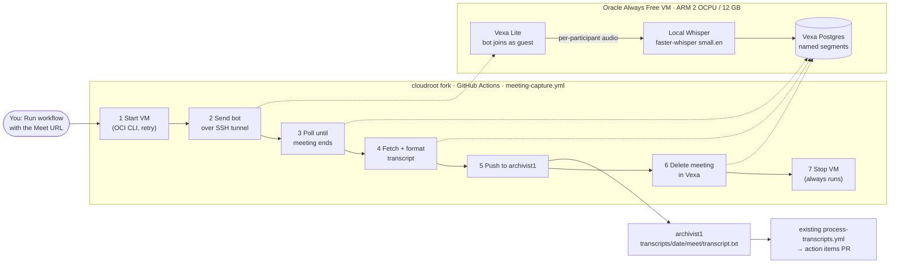
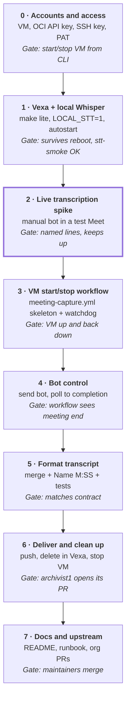

# Meeting Capture Bot — Project Plan

## Overview

A self-hosted Vexa bot joins a Google Meet call as an anonymous guest and **transcribes it live** on an Oracle VM, with each participant's real name. When the call ends, a cloudroot GitHub Actions workflow formats the transcript, pushes it to archivist1, deletes it from the VM, and stops the VM.

The file lands at `transcripts/<YYYY-MM-DD>/meet/transcript.txt` on archivist1's `main`. That push starts archivist1's existing `process-transcripts.yml`, which extracts action items. archivist1 needs **no code changes**.

**Constraints:** $0 running cost. No meeting data left in the cloud after a job: Vexa runs with audio recording off, and the transcript is deleted from the VM once it's pushed. The VM runs only around meetings.

**In scope:** starting and stopping the VM, the bot, live transcription, formatting, and the push to archivist1.

**Out of scope:** action-item extraction (archivist1 already does it), ingestion into cloudroot's Pinecone knowledge base (another team owns it), calendar auto-join, Zoom and Teams, and cross-talk accuracy beyond what Vexa gives.

**How we work:** all code is built in the **cloudroot fork** and pushes to the **archivist1 fork**. Each phase ends in one reviewable commit. Work moves upstream to the organization's repos only after phase 6 passes.

## Architecture

One cloudroot workflow runs the whole job. It starts the stopped VM, sends the bot, waits for the meeting to end, pushes the transcript, cleans up, and stops the VM. The VM does the joining and live transcription. It keeps no audio, and its transcript copy is deleted at the end.



1. About 5–10 minutes before the meeting, you run the **Meeting capture** workflow in the cloudroot fork's Actions tab and paste the Meet URL. That is the only manual step.
2. The workflow starts the stopped VM with the Oracle CLI. If Oracle reports "out of host capacity", it retries for a few minutes. Vexa starts by itself on boot.
3. Over an SSH tunnel, the workflow calls Vexa's API to send a bot. The bot joins as an anonymous guest, and someone in the call admits it from the lobby.
4. Once admitted, Vexa transcribes each participant's audio channel separately with the local Whisper model. Every line is tagged with the participant's Meet name, even when people talk over each other. Audio recording is off, so no audio is stored.
5. The bot leaves when everyone else has left. The workflow sees the meeting finish, waits for the last segments to be confirmed, and fetches the transcript.
6. It merges consecutive lines from the same speaker, formats them as `Name  M:SS` then the text (the same shape as today's Otter files), and pushes the file to archivist1.
7. After the push succeeds, it deletes the meeting from Vexa. A final step that always runs, even after a failure, stops the VM. If the push fails, the transcript stays in Vexa so the job can be rerun.

## Tech stack and cost

Every piece is free software or part of Oracle's Always Free tier. Nothing depends on a trial credit or a paid API.

| Piece | Role | Cost | Why it stays free |
| --- | --- | --- | --- |
| Oracle Ampere A1 VM (Ubuntu 24.04, ARM) | Runs Vexa and live transcription, only around meetings | $0 | Always Free allows 2 OCPU / 12 GB of A1 compute and 200 GB of block storage. A stopped VM keeps its disk and costs nothing. |
| Vexa Lite v0.12 (self-hosted) | Google Meet bot, per-participant audio, speaker names | $0 | Apache-2.0. Self-hosting doesn't use the paid vexa.ai service. |
| Local Whisper: faster-whisper server, bundled with Vexa (`LOCAL_STT=1`) | Live speech to text on the VM's CPU | $0 | Runs OpenAI's open Whisper weights (MIT) on the VM. No API key, no per-minute billing. ARM image available. |
| GitHub Actions (cloudroot fork, public) | Runs the capture workflow: start VM, wait, format, push, stop VM | $0 | Standard runners are free for public repos, up to 6 hours per job. |
| Oracle CLI (`oci`) | Starts and stops the VM from the workflow | $0 | Free tool using an API key on the Always Free account. |
| archivist1 `process-transcripts.yml` | Turns the transcript into action items | Unchanged | Already running; this plan only adds a text file. |

**Rule to protect the $0:** keep the Oracle account on the Free Tier. Don't upgrade to Pay-As-You-Go unless the team decides to.

**Free fallbacks if CPU Whisper can't keep up** (decide in phase 2):

- A smaller model (`base.en`): faster, a bit less accurate.
- Cloudflare Workers AI Whisper: 10,000 free units a day, about 214 audio minutes. Vexa can point at it through an OpenAI-compatible proxy, and the org already uses Cloudflare.
- Groq's free tier: Whisper large-v3, up to 8 hours of audio a day. Fastest and most accurate, but it's a hosted API with daily caps, and audio leaves the VM.

## Definitions

| Term | Meaning in this plan |
| --- | --- |
| Vexa | Open-source meeting bot. It joins a Google Meet as a participant and transcribes it. |
| Vexa Lite | Vexa's single-container install, started with `make lite`. Includes its own Postgres and MinIO. |
| Anonymous guest join | Vexa's default. The bot knocks on the Meet lobby under a guest name, and someone admits it. No Google account needed. |
| Live transcription | Vexa transcribes while the meeting runs, instead of recording audio and transcribing afterward. |
| Per-participant audio channel | Meet sends Vexa a separate audio stream for each speaker. Vexa transcribes each one on its own, which is how lines get the right name. |
| Local STT (`LOCAL_STT=1`) | Vexa setting that runs a faster-whisper server on the same VM, so transcription needs no API. |
| faster-whisper | A faster engine for OpenAI's open Whisper model weights. Same model, about 4× quicker on CPU. |
| `small.en` / `base.en` | Whisper model sizes for English. Bigger is more accurate and slower. Vexa's default `tiny` is the fastest and least accurate. |
| Segment | One transcribed line from Vexa: speaker name, start and end time, text. `completed: true` means final. |
| Recording off (`recording_enabled: false`) | The bot doesn't save audio, so no audio ever exists to clean up. |
| `awaiting_admission` | Bot status while it waits in the lobby. `max_wait_for_admission` sets how long it waits. |
| Oracle CLI (`oci`) + API key | Command-line tool and credentials the workflow uses to start, stop, and look up the VM. |
| SSH tunnel | Encrypted connection from the workflow to the VM, so Vexa's API never has to be open to the internet. |
| Watchdog | A small timer on the VM that shuts it down if it sits idle, as a backup if the workflow dies. |
| PAT | GitHub fine-grained personal access token. Here, one token that can only write to archivist1. |
| Transcript contract | The path and format archivist1 expects: `transcripts/<YYYY-MM-DD>/<source>/transcript.txt`, one source per date, UTF-8. |
| Gate | The check that must pass before the next phase starts. |

## Build phases

Eight phases, each with a gate. Phase 2 is the go/no-go point: it checks that 2 ARM cores can transcribe a real meeting live with correct names.



| Phase | What gets built | Done when (gate) |
| --- | --- | --- |
| 0 · Accounts and access | Create the A1 VM once (Ubuntu 24.04, 2 OCPU / 12 GB) with Docker and `make`. Create an OCI API key for automation, an SSH key pair for the workflow, and a fine-grained PAT with Contents write on archivist1 only. Infra only, no commit. | From your laptop, `oci compute instance action --action STOP` and `START` work, and you can SSH in after a restart. |
| 1 · Vexa + local Whisper | Run `make lite` with `LOCAL_STT=1` and `WHISPER_MODEL=Systran/faster-whisper-small.en`, and build the bot image on ARM. Add a systemd unit so Vexa starts on boot. Save a Vexa API key. Commit `vm/setup.sh` and the unit file. | After stop then start, Vexa comes up with no manual steps. `make -C deploy/lite stt-smoke` and `make probe` pass. |
| 2 · Live transcription spike | Send a bot by hand (`POST /bots`, `transcribe_enabled: true`, `recording_enabled: false`) into a test Meet: 3 people, about 20 minutes, some cross-talk. Watch CPU with `htop`. Save the segments as test fixtures. | Most lines carry the right Meet names. Transcription keeps up, or finishes within a few minutes of the call ending, with nothing missing. If not, try `base.en`, then a free fallback from Tech stack. Model choice written down. |
| 3 · VM start/stop workflow | `meeting-capture.yml` (manual run, `meet_url` input): start the VM with retry on "out of host capacity", look up its IP, wait for Vexa's health check over SSH, then stop the VM in an always-run step. Add the idle watchdog on the VM. | A run with a dummy URL brings the VM up, reaches Vexa, and leaves the VM stopped. The watchdog stops a VM left idle on purpose. |
| 4 · Bot control | `pipeline/capture.py`: send the bot through the SSH tunnel, then poll status. Handle the lobby timeout, rejection, and bot failure with clear errors. | On a real call, the workflow log shows admitted → active → completed, and the job ends on its own when the meeting ends. |
| 5 · Format transcript | `pipeline/format.py`: fetch confirmed segments, merge consecutive lines from the same speaker, label unnamed ones `Unknown speaker`, write `Name  M:SS` blocks. Unit tests use the phase-2 fixtures. | Output matches the transcript contract and the shape of archivist1's archived Otter files. Nothing is pushed yet. |
| 6 · Deliver and clean up | `pipeline/deliver.py`: push `transcript.txt` to the archivist1 fork's `main`, then `DELETE` the meeting in Vexa, then stop the VM. If the push fails, keep the transcript and fail loudly. | End to end on a real call: archivist1's workflow opens its draft PR, Vexa holds no meeting data, and the VM is stopped. |
| 7 · Docs and upstream | cloudroot README section: how to run a capture, the secrets list, and a troubleshooting runbook. Open PRs to the organization's repos. | Maintainers review and merge. The org repo gets its own secrets, and the archivist1 target switches from the fork to the org repo. |

Phases 0 and 1 are setup only. Phase 2 decides the model. After phase 6 the pipeline is working, and phase 7 hands it to the organization.

## Secrets and config

No secret is committed to either repo. The workflow reads everything from cloudroot repository secrets. The VM keeps only Vexa's own config in a `.env` file that only its user can read (`chmod 600`).

| Secret | Lives in | Used for |
| --- | --- | --- |
| `OCI_CLI_USER`, `OCI_CLI_TENANCY`, `OCI_CLI_FINGERPRINT`, `OCI_CLI_KEY_CONTENT`, `OCI_CLI_REGION` | cloudroot secrets | Oracle CLI: start, stop, and look up the VM |
| `OCI_INSTANCE_ID` | cloudroot variable | Which VM to start |
| `VM_SSH_KEY` | cloudroot secrets | SSH tunnel from the workflow to the VM. Key-only login, no passwords. |
| `VEXA_API_KEY` | cloudroot secrets + VM `.env` | Calling Vexa's API through the tunnel |
| `ARCHIVIST_PUSH_TOKEN` | cloudroot secrets | Pushing `transcript.txt` to archivist1. Fine-grained PAT with Contents write on archivist1 only. |
| `ARCHIVIST_REPO` | cloudroot variable | `ravi-p-k-1/archivist1` now, the org repo after phase 7 |

Vexa's API port stays closed to the internet. Only SSH (port 22, key-only) is open on the VM.

## Repo structure

New code goes in one folder plus one workflow in the cloudroot fork. It doesn't touch `worker/`, `chat/` or the existing deploy workflows.

```
cloudroot/
├── .github/workflows/
│   └── meeting-capture.yml         # manual run with meet_url; start VM → … → stop VM
└── meeting-capture/
    ├── README.md
    ├── vm/                         # one-time VM setup, lives on the VM's disk
    │   ├── setup.sh                # install Docker, Vexa Lite, local Whisper
    │   ├── vexa.service            # systemd: start Vexa on boot
    │   ├── watchdog.sh + .timer    # shut down if idle
    │   └── .env.example
    ├── pipeline/                   # runs on the GitHub Actions runner
    │   ├── vm.sh                   # oci start/stop/ip with retry
    │   ├── capture.py              # send bot, poll to completion
    │   ├── format.py               # segments → Name  M:SS transcript
    │   ├── deliver.py              # push to archivist1, delete in Vexa
    │   └── requirements.txt
    └── tests/
        ├── fixtures/               # phase-2 segments JSON
        └── test_format.py
```

## What changed from the old draft

| Topic | Old draft (Sept 12) | This plan |
| --- | --- | --- |
| Where code lives | `meeting_capture/` inside archivist | cloudroot fork. archivist1 only receives the transcript. |
| Transcription | Record audio, then whisper.cpp afterward | Vexa transcribes live on the VM with local faster-whisper (same OpenAI Whisper weights) |
| Speaker names | Merge Whisper output with `speaker_events` | Vexa names each line from Meet's per-participant audio. `speaker_events` has no writer in Vexa v0.12 (issue #861), so the old merge can't work. |
| Audio storage | Vexa's MinIO, deleted after push | None. Recording is off, so no audio is ever stored. No storage bucket needed. |
| VM lifetime | Always on | Stopped between meetings. The workflow starts it and always stops it. |
| Trigger | Run a script on the VM | Run the cloudroot workflow with the Meet URL |
| Push to archivist | `git push` from the VM | The workflow pushes with a PAT scoped to archivist1 |
| Bot identity | Not decided | Anonymous guest, admitted from the lobby |
| Steps | 8 checklist items | 8 phases with gates and a go/no-go at phase 2 |

## Risks and open questions

**Risks**

- **CPU may not keep up live.** Two ARM cores transcribe each speaker's channel separately, so busy meetings load the CPU more. Phase 2 measures this. Fallbacks, in order: `base.en`, then Cloudflare Workers AI or Groq free tiers.
- **Oracle can't start the VM.** Free ARM capacity is often short, and a start can fail with "out of host capacity". The workflow retries, and you run it 5–10 minutes early. If it still fails, that meeting isn't captured, so keep a manual backup (for example, a phone recorder) for important meetings until this has proven reliable.
- **Vexa changes fast.** v0.12 removed `speaker_events` without much notice. Pin the Vexa version on the VM and upgrade on purpose, not automatically.
- **Some lines may have no name.** Vexa leaves about 4–7% of lines unnamed under heavy cross-talk. They become `Unknown speaker`. Accepted.
- **Long meetings.** A GitHub Actions job stops at 6 hours, so a meeting longer than about 5.5 hours would lose the push. The watchdog still stops the VM.

**Resolved since the last version**

- `speaker_events`: checked in Vexa's source. It has no writer in v0.12 (issue #861), which led to the switch to live transcription.
- Admitting the bot: someone in the call admits it.
- Bot identity: anonymous guest, Vexa's default. No Google account needed.
- Cross-talk: accepted as is. One transcript per date: confirmed.
- cloudroot is public in the fork and upstream, so Actions minutes are free.
- Trigger: a manual workflow run. The VM is started for each meeting and stopped afterward, instead of being created and deleted, because rebuilding Vexa on ARM every time is slow and new free ARM VMs often can't be created.

**Open questions**

- [ ] Which timezone sets the transcript date: the org's local time, or UTC? Matters for evening meetings.
- [ ] Who else, besides you, should be able to run the capture workflow on the org repo after phase 7?

## Sources

- [Oracle Always Free resources (official)](https://docs.oracle.com/en-us/iaas/Content/FreeTier/freetier_topic-Always_Free_Resources.htm): A1 limits and idle-reclaim rule
- [Oracle Cloud free tier 2026 change: 4/24 cut to 2/12](https://terminalbytes.com/oracle-cloud-free-tier-changes-2026/)
- [Vexa repo](https://github.com/Vexa-ai/vexa): `deploy/lite/README.md` (LOCAL\_STT), `docs/docs/api/meetings.mdx` (bots, segments, delete), `docs/docs/authenticated-bots.mdx` (anonymous default), `docs/docs/troubleshooting.mdx` (admission), `meeting-api/.../collector/app.py` (speaker\_events has no writer, #861), `bot/src/pipeline.ts` (capture-only drops speaker data)
- [faster-whisper-server image](https://hub.docker.com/r/fedirz/faster-whisper-server): CPU image with an arm64 build
- [openai/whisper](https://github.com/openai/whisper): MIT-licensed model weights
- [Cloudflare Workers AI pricing](https://developers.cloudflare.com/workers-ai/platform/pricing/) and [Groq rate limits](https://console.groq.com/docs/rate-limits): free fallbacks
- [archivist1 fork](https://github.com/ravi-p-k-1/archivist1) and [cloudroot fork](https://github.com/ravi-p-k-1/cloudroot)
