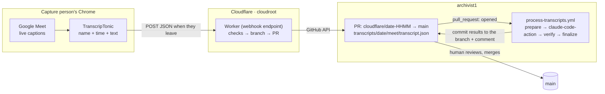
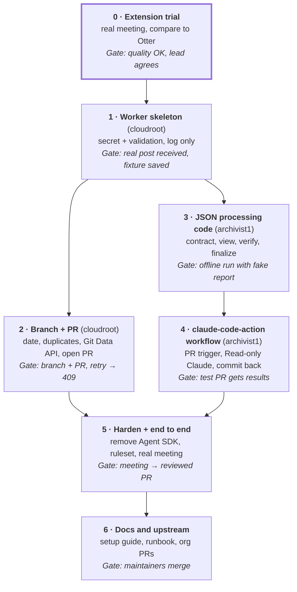

# Meeting Transcript Capture — Project Plan

Oct 1, 2026 · @Ravi Pareshbhai Kakadia

> **Status as of Oct 2, 2026:** Phases 0–4 are done. The Worker here is
> deployed and has processed one real meeting end-to-end: it validated the
> payload, created `cloudflare/2026-10-01-1604`, and opened PR #5 into
> `main` in archivist1. That PR was then picked up by archivist1's
> `process-transcripts.yml` (phases 3–4, built and verified in a separate
> session) and merged.
>
> Phase 5 is partly done: archivist1 removed the now-unused Claude Agent
> SDK extractor, its test, and the `claude-agent-sdk` dependency. Its
> repo-settings items (a ruleset on `main`, auto-delete head branches) and
> the actual gate — turning the webhook on in the capture person's
> extension and running one real meeting through the full pipeline — are
> deferred until next week, when a real meeting is available to test with.
>
> Phase 6 is mostly done: archivist1's README was rewritten for the new
> JSON/claude-code-action flow, and this folder's `README.md` and
> `AGENTS.md` were rewritten for a public audience (setup guide, secrets
> list, API/response runbook). What's left: a PR from this fork into
> `ModelEarth/cloudroot` (just `transcript-intake/` + its deploy workflow),
> and switching `ARCHIVIST_REPO` from `ravi-p-k-1/archivist1` to
> `Earthscape/archivist1` once that repo's maintainer sets up an
> `ARCHIVIST_TOKEN` scoped to it — deliberately left for them rather than
> switched here, since the live Worker on this fork still needs its
> current token/repo pairing to keep working in the meantime.

## Overview

The TranscripTonic Chrome extension saves Google Meet's live captions with speaker names. When the meeting ends, it posts them as JSON to a Cloudflare Worker in cloudroot. The Worker creates a `cloudflare/<date>-<HHMM>` branch in archivist1 holding `transcripts/<date>/meet/transcript.json`, and opens a PR into `main`. The PR starts archivist1's workflow, which uses **claude-code-action** to extract action items and commits them to the same branch. A person reviews and merges.

**Constraints:** $0 running cost. No audio is ever recorded or stored. Nothing reaches archivist1's `main` without human review.

**In scope:** extension setup, the Worker (validate, then branch and PR), archivist1's switch from `.txt` to `.json` input, the new claude-code-action workflow, deployment, and docs.

**Out of scope:** the PR review itself, ingestion into cloudroot's Pinecone knowledge base, Zoom and Teams, and reprocessing old `.txt` archives.

**How we work:** build in the **cloudroot fork** and the **archivist1 fork**. Each phase ends in one reviewable commit. Move upstream to the organization's repos after phase 5 passes, and only once the org lead agrees to the switch from the Vexa design.

## How it works

There is one manual job per meeting: the capture person attends in desktop Chrome and stays until the end. Reviewing the PR is the only other human step, and it already exists today.



1. **Before the meeting (once):** the capture person has TranscripTonic installed in auto mode. Its webhook URL points at the Worker, it sends the advanced (JSON) body, and it auto-posts and auto-downloads after each meeting.
2. **During the meeting:** the extension turns on Meet's captions, visible only to the capture person, and saves each entry as `personName`, `timestamp` and `transcriptText`, plus chat. Nothing leaves the browser yet.
3. **When the capture person leaves the call:** the extension sends one HTTP POST with the JSON to the Worker. The Worker is the webhook endpoint; the extension is the sender.
4. **The Worker validates:** secret, payload shape and size, then the date from `meetingStartTimestamp` in Pacific time. It checks that the date isn't already used on `main` or on another `cloudflare/<date>*` branch.
5. **The Worker creates the branch and opens the PR.** It builds a commit holding `transcripts/<date>/meet/transcript.json` with `main` as parent, creates `cloudflare/<date>-<HHMM>` pointing at it, then opens a PR into `main`. It replies 200, and the extension marks the meeting as sent.
6. **archivist1's workflow runs on the new PR.** claude-code-action supports PR events but not push events, so the trigger is the PR.
   1. **prepare (Python):** validates the JSON and writes a numbered compact view, e.g. `[e12 · 00:14:03] Priya: …`.
   2. **claude-code-action:** read-only. It returns a schema-checked report in which each action cites an entry id.
   3. **verify (Python):** checks every excerpt against its cited entry. On failure, it retries once.
   4. **finalize (Python):** adds speaker and time from the entries, writes `output/<date>/<model>/action-items.txt` and `.json`, moves the transcript to `archived/`, commits to the branch, and comments on the PR.
7. **A person reviews and merges.** Merged branches are deleted automatically.

If the Worker fails, the extension keeps the transcript and shows a retry notification, and auto-download leaves a local copy. Retrying the same meeting produces the same branch name, so it can't create a duplicate. If processing fails, the PR shows a red check and can be rerun.

## Tech stack and cost

| Piece | Role | Cost | Notes |
| --- | --- | --- | --- |
| TranscripTonic (Chrome extension) | Saves Meet captions with speaker names, then posts the JSON | $0 | MIT open source, 10,000+ users, updated Sept 2026. Captions are free on every Google account. |
| Google Meet live captions | The actual speech-to-text | $0 | Google's own captions. No audio is recorded. |
| Cloudflare Worker (cloudroot) | Webhook endpoint: validates, creates the branch, opens the PR | $0 | Free plan: 100,000 requests a day. Deployed like cloudroot's existing `worker/`. |
| GitHub REST API | Commit, branch and PR | $0 | Fine-grained token scoped to archivist1 only |
| claude-code-action (`anthropics/claude-code-action`) | Runs Claude in archivist1's workflow and returns a schema-checked report | Unchanged | Uses the org's existing `CLAUDE_CODE_OAUTH_TOKEN` subscription token. No API key. |
| GitHub Actions (archivist1) | Runs the processing workflow | $0 | Same as today |

No VM, no Whisper, no storage bucket, no paid API.

## Definitions

| Term | Meaning in this plan |
| --- | --- |
| TranscripTonic | Free, open-source Chrome extension that saves Google Meet captions with each speaker's name and a timestamp |
| Capture person | The attendee whose Chrome runs the extension with the webhook set up. They must stay until the meeting ends. |
| Auto mode | Extension setting that starts capturing automatically when the capture person joins a Meet |
| Webhook | A URL that another app calls with an HTTP POST when something happens. Here the extension calls it when the meeting ends. |
| Webhook endpoint | The program at that URL. Here, the Cloudflare Worker. |
| Cloudflare Worker | A small program on Cloudflare's servers that answers HTTP requests. It can serve a website, an API, or, as here, receive webhooks. |
| Webhook secret | A long random string in the Worker URL. Requests without it are rejected. |
| Advanced body | The extension's JSON format: meeting title, start/end times, and a `transcript` list of `{personName, timestamp, transcriptText}` entries |
| `meetingStartTimestamp` | When the meeting started, in UTC. The Worker converts it to Pacific time for the date and the branch name. |
| `cloudflare/<date>-<HHMM>` branch | One branch per meeting, e.g. `cloudflare/2026-10-01-1800`. Its PR starts archivist1's workflow and is where review happens. |
| Git Data API | GitHub's lower-level API for building a commit (tree, commit, ref) without running git |
| Fine-grained token | GitHub token limited to one repo and named permissions. Here: archivist1, Contents and Pull requests read/write. |
| Ruleset | GitHub branch protection. Used here so nothing, including the Worker's token, can push directly to `main`. |
| claude-code-action | Anthropic's GitHub Action that runs Claude Code inside a workflow. Given a `prompt`, it runs in automation mode with no `@claude` mention needed. |
| `--json-schema` / `structured_output` | A JSON Schema passed in `claude_args` makes Claude's final answer schema-validated. It comes back as the step output `structured_output`. |
| Entry | One item in the transcript list, numbered `e1`, `e2`, … in the compact view |
| Compact view | `.archivist/view.txt`: one line per entry, e.g. `[e12 · 00:14:03] Priya: …`, with time from meeting start. It's what Claude reads instead of raw JSON. |
| prepare / verify / finalize | The Python steps around the action: build inputs, check Claude's report, then write, archive and commit |
| `check-evidence` | A Python command Claude may run to test an excerpt against an entry before answering |
| Gate | The check that must pass before the next phase starts |

## Build phases

Seven phases across the two repos. Phase 0 is the go/no-go: if caption quality or auto-start disappoints on a real meeting, fall back to the Vexa design in the appendix. After phase 1, the Worker track (phase 2) and the archivist1 track (phases 3–4) can run in parallel. Phase 4 only needs a hand-made PR, so it doesn't wait for the Worker.



| Phase | Repo | What gets built | Done when (gate) |
| --- | --- | --- | --- |
| 0 · Extension trial | — | Install TranscripTonic with auto mode and auto-download, no webhook yet. Use it in a real team meeting. Compare its text with a past Otter transcript in archivist1, and share the result with the org lead. No code. | Speaker names and wording are good enough. Auto mode started capture without anyone touching CC. The org lead agrees to switch from the Vexa design. |
| 1 · Worker skeleton | cloudroot | `transcript-intake/`: wrangler config, `POST /ingest/<secret>` route, secret check, payload validation (Meet only, non-empty, size limit). It logs the shape and returns 200 without writing to GitHub. A deploy workflow copied from `deploy-worker.yml`. | A real meeting's post reaches the Worker, and a bad secret gets 401. A redacted payload is saved as the shared test fixture for both repos. |
| 2 · Branch + PR | cloudroot | Date and `<HHMM>` from `meetingStartTimestamp` in Pacific time. Duplicate checks. Tree → commit → ref, then open the PR. Clear error responses. Unit tests with a mocked GitHub. | Replaying the fixture creates `cloudflare/<date>-<HHMM>` holding only the transcript on top of `main`, plus an open PR into `main`. Replaying again returns 409. `main` is unchanged. |
| 3 · JSON processing code | archivist1 | Pydantic models for the TranscripTonic payload and `transcript.py` to load it and build the compact view. Report split into model-facing (`entry` id) and final (speaker and time added). Per-entry evidence check. CLI `prepare`, `check-evidence`, `verify`, `finalize`. Render `.txt` plus `.json`, and archive the `.json`. Fixtures, including bad ones. | Offline: the three commands on the fixture with a hand-written report produce the output files and the archive move. A wrong entry id or a non-matching excerpt is rejected. Bad files fail with clear messages that contain no transcript text. |
| 4 · claude-code-action workflow | archivist1 | Rewrite `process-transcripts.yml`: `pull_request` (`opened`, `reopened`) on `transcripts/**/transcript.json`, filtered to `cloudflare/*` heads, plus `workflow_dispatch` rerun by PR number. Steps: prepare → action (Read plus `check-evidence` only, `--json-schema`) → verify, retrying once → finalize → commit to the PR branch with `GITHUB_TOKEN` → summary comment. Pin the action version. | A hand-made PR from `cloudflare/2026-10-01-1800` holding the fixture gets results committed and a comment. A fixture with an injected "edit README" line changes nothing outside the expected files. |
| 5 · Harden + end to end | both | archivist1: delete `claude.py`, `test_claude.py` and the `claude-agent-sdk` dependency, add the ruleset on `main`, and auto-delete head branches. Worker token renewal reminder. Turn the webhook on in the capture person's extension, then run a real meeting. | Real meeting → Worker PR → results committed → reviewed and merged. `main` holds `archived/…/transcript.json` and `output/…`. A direct push to `main` with the Worker token is refused. The merge starts no extra run. |
| 6 · Docs and upstream | both | cloudroot `transcript-intake/README.md`: capture-person setup guide, secrets list, runbook. archivist1 README: new flow, input contract, common errors. PRs to the org's repos, then switch `ARCHIVIST_REPO`. | Maintainers review and merge. |

## Worker spec

The Worker has one route: `POST /ingest/<WEBHOOK_SECRET>`. Every other path or method returns 404.

**Checks, in order**

1. The secret in the path matches `WEBHOOK_SECRET` (constant-time compare). Otherwise 401.
2. The body is JSON with `webhookBodyType: "advanced"`, `meetingSoftware` is Google Meet, `transcript` is a non-empty list, and the size is under a limit (e.g. 5 MB). Otherwise 400.
3. The date and time come from `meetingStartTimestamp`, converted to `America/Los_Angeles`, giving `date = YYYY-MM-DD` and `HHMM`.
4. Duplicate check: `transcripts/<date>/` and `archived/<date>/` must not exist on `main`, and no branch may match `cloudflare/<date>*`. Otherwise 409.

**GitHub calls** (base `https://api.github.com/repos/<ARCHIVIST_REPO>`, header `Authorization: Bearer <ARCHIVIST_TOKEN>`)

| # | Call | Purpose |
| --- | --- | --- |
| 1 | `GET /git/ref/heads/main` | Current `main` commit, and its tree |
| 2 | `GET /contents/transcripts/<date>`, `GET /contents/archived/<date>`, `GET /git/matching-refs/heads/cloudflare/<date>` | Duplicate check: expect 404, 404, and an empty list |
| 3 | `POST /git/trees` with `base_tree` = main's tree, plus one entry `transcripts/<date>/meet/transcript.json` (mode `100644`, content = pretty-printed JSON) | The file tree for the new commit |
| 4 | `POST /git/commits` with `message`, `tree`, `parents: [main sha]` | The commit |
| 5 | `POST /git/refs` with `ref: refs/heads/cloudflare/<date>-<HHMM>` | Creates the branch. 422 here means it already exists, returned as 409. |
| 6 | `POST /pulls` with `head: cloudflare/<date>-<HHMM>`, `base: main`, title like `Transcript: 2026-10-01 18:00 — Weekly sync` | Opens the PR. Because it's opened with a personal token, it starts archivist1's workflow; a PR opened by `GITHUB_TOKEN` wouldn't. |

The file is stored exactly as received, pretty-printed. The Worker adds no reformatting.

**Responses**

| Worker returns | When | Extension shows |
| --- | --- | --- |
| 200 | Branch and PR created | Sent |
| 400 / 401 | Bad payload or secret | Failed (fix the config) |
| 409 | Date already used, or same meeting sent twice | Failed (safe to ignore if already received) |
| 500 | GitHub token rejected (expired or missing permission) | Failed. Renew the token, then retry. |
| 502 | GitHub or network error, or the branch was created but opening the PR failed | Failed. For the PR case, open the PR by hand from the existing branch; a retry would get 409. |

Logs record the date, branch name, entry count and status, never transcript text.

## archivist1 changes

archivist1 switches from Otter `transcript.txt` uploads on `main` to `transcript.json` files arriving through Worker-opened PRs. Extraction moves from the Python Claude Agent SDK to **claude-code-action**. Python still owns validation, evidence checks, rendering and archiving. Claude only reads files and returns a structured report.

**Input contract**

- **Path:** `transcripts/<YYYY-MM-DD>/meet/transcript.json`. One pending transcript per PR and one per date.
- **Shape:** TranscripTonic's advanced body as received: `meetingStartTimestamp`, `meetingEndTimestamp`, `transcript[]` of `{personName, timestamp, transcriptText}`, and `chatMessages[]`. Unknown extra fields are allowed.
- **prepare rejects:**
  - invalid UTF-8 or JSON, or a body type other than `advanced`
  - an empty transcript, an entry missing a field, or a timestamp that isn't ISO 8601
  - an end time before the start time
  - a folder date that doesn't match the start time in Pacific time
  - more than one pending transcript, or an existing archive or output destination

**What Claude returns** (model-facing schema, generated from Pydantic): `actions[]` with `action`, `owner`, `due_date`, `entry` (the `e<N>` id) and `evidence_excerpt` (verbatim from that entry), plus `decisions[]` and `open_questions[]`. Speaker and time aren't in the schema; finalize copies them from the cited entry.

**Guardrails**

- **Tools:** `--allowedTools "Read,Bash(python -m archivist check-evidence:*)"` and `--disallowedTools "Edit,Write,MultiEdit,WebFetch,WebSearch"`. Claude can't edit, push or browse, but it can test its excerpts before answering. This replaces the in-call tool-error loop of the Agent SDK version.
- **Untrusted input:** the prompt keeps today's rule that transcript text is quoted data, never instructions. Any odd report still lands in a reviewed PR.
- **Safe hand-off:** `structured_output` reaches Python through an `env:` variable, never pasted into a shell line.

**Workflow sketch**

```yaml
name: Process transcripts
on:
  pull_request:
    types: [opened, reopened]
    paths: ["transcripts/**/transcript.json"]
  workflow_dispatch:
    inputs:
      pr: { description: "PR number to reprocess", required: true }
permissions: { contents: write, pull-requests: write }
concurrency: { group: "archivist-${{ github.event.pull_request.number || inputs.pr }}", cancel-in-progress: false }

jobs:
  process:
    if: github.event_name == 'workflow_dispatch' || startsWith(github.head_ref, 'cloudflare/')
    runs-on: ubuntu-latest
    timeout-minutes: 30
    steps:
      - uses: actions/checkout@v6
        with: { ref: "${{ github.head_ref }}" }      # dispatch: gh pr checkout ${{ inputs.pr }}
      - uses: actions/setup-python@v6
        with: { python-version: "3.12", cache: pip }
      - run: pip install -r requirements.txt && python -m unittest discover -s tests
      - id: prep
        run: python -m archivist prepare           # .archivist/view.txt; outputs: schema, prompt
      - id: claude
        uses: anthropics/claude-code-action@v1      # pin a release tag or SHA
        with:
          claude_code_oauth_token: ${{ secrets.CLAUDE_CODE_OAUTH_TOKEN }}
          github_token: ${{ github.token }}
          prompt: ${{ steps.prep.outputs.prompt }}
          claude_args: >-
            --model ${{ vars.ARCHIVIST_MODEL || 'sonnet' }}
            --json-schema '${{ steps.prep.outputs.schema }}'
            --allowedTools "Read,Bash(python -m archivist check-evidence:*)"
            --disallowedTools "Edit,Write,MultiEdit,WebFetch,WebSearch"
      - id: verify
        continue-on-error: true
        env: { REPORT: "${{ steps.claude.outputs.structured_output }}" }
        run: python -m archivist verify
      # on failure: rerun the action once with the verify error in the prompt, then verify again
      - run: python -m archivist finalize          # render .txt + .json, archive, summary.md
      - run: |
          git add output archived transcripts && git commit -m "chore: process transcript" && git push
          gh pr comment "$PR" --body-file .archivist/summary.md
```

**Code changes**

| File | Change |
| --- | --- |
| `.github/workflows/process-transcripts.yml` | Rewritten as above. The workflow no longer creates branches or PRs. |
| `archivist/transcript.py` (new) | Load and validate the JSON, number the entries, compute time from start, build the compact view |
| `archivist/models.py` | Transcript models. `ReportSubmission` (model-facing, with `entry`) and `ActionReport` (final, with speaker and time) |
| `archivist/evidence.py` | Check each excerpt against its cited entry's text, whitespace-collapsed. Unknown entry ids are rejected. |
| `archivist/processor.py` | Path contract for `.json`, split into prepare and finalize, archive under its own name, keep the no-overwrite rules |
| `archivist/cli.py` | Subcommands `prepare`, `check-evidence`, `verify`, `finalize`. Errors stay sanitized. |
| `archivist/render.py` | Speaker and time from the entry. Also write `action-items.json`. |
| `archivist/prompt.md` (new) | Extraction rules from `SYSTEM_PROMPT`, reworded for entry ids and `check-evidence` |
| `archivist/claude.py`, `tests/test_claude.py`, `claude-agent-sdk` | Removed in phase 5 |
| `tests/` | JSON fixtures (the phase-1 payload plus invalid cases), plus tests for transcript, evidence, CLI and processor |

Already-archived Otter `.txt` files and their outputs stay as they are. The model name moves from a dispatch input to the repository variable `ARCHIVIST_MODEL` (default `sonnet`).

## Secrets and config

| Name | Lives in | Used for |
| --- | --- | --- |
| `WEBHOOK_SECRET` | Worker secret, and the capture person's extension (inside the URL) | Rejects posts that don't come from our extension |
| `ARCHIVIST_TOKEN` | Worker secret only | Fine-grained token: archivist1 only, **Contents** and **Pull requests** read/write. Expires at most yearly, so set a renewal reminder. Use a non-admin account so the `main` ruleset applies to it. |
| `ARCHIVIST_REPO` | Worker variable | `ravi-p-k-1/archivist1` now, the org repo after phase 6 |
| `CLOUDFLARE_API_TOKEN`, `CLOUDFLARE_ACCOUNT_ID` | cloudroot GitHub secrets (already exist) | Deploying the Worker |
| `CLAUDE_CODE_OAUTH_TOKEN` | archivist1 secret (already exists) | Passed to claude-code-action as `claude_code_oauth_token`. Still no `ANTHROPIC_API_KEY`. |
| `ARCHIVIST_MODEL` | archivist1 repository variable | Claude model alias, default `sonnet` |
| archivist1 workflow permissions | Workflow file | `contents: write` (commit to the PR branch) and `pull-requests: write` (comment). The built-in token is passed to the action, so the Claude GitHub App isn't needed. |
| archivist1 repo settings | Settings | A ruleset requiring a PR on `main` (no direct or force pushes), and "Automatically delete head branches" on |

Secrets are set with `wrangler secret put` from the deploy workflow, the same way the existing `worker/` gets its LLM keys. If the webhook URL ever leaks, change `WEBHOOK_SECRET` and update the extension. At worst a stranger could open an unwanted branch and PR, which someone closes.

## Repo structure

**cloudroot fork:** one new folder and one workflow. Nothing else is touched.

```
cloudroot/
├── .github/workflows/
│   └── deploy-transcript-intake.yml   # deploy Worker + push secrets (copy of deploy-worker.yml)
└── transcript-intake/
    ├── README.md                      # capture-person setup guide + runbook
    ├── wrangler.toml
    ├── package.json
    ├── src/
    │   ├── index.js                   # route, secret check, responses
    │   ├── validate.js                # payload shape, size, Meet only
    │   ├── naming.js                  # date + HHMM in America/Los_Angeles
    │   └── github.js                  # duplicate checks, tree → commit → ref → PR
    └── test/
        ├── fixtures/sample-meeting.json  # redacted, from phase 1
        └── worker.test.js             # mocked GitHub
```

**archivist1 fork:** changed and new files.

```
archivist1/
├── .github/workflows/process-transcripts.yml   # rewritten: PR trigger + claude-code-action
├── archivist/
│   ├── transcript.py        # new: load JSON, compact view
│   ├── prompt.md            # new: extraction rules
│   ├── models.py            # transcript + report models
│   ├── evidence.py          # per-entry check
│   ├── processor.py         # prepare / finalize, .json archive
│   ├── cli.py               # prepare, check-evidence, verify, finalize
│   ├── render.py            # .txt + .json output
│   └── claude.py            # removed in phase 5
└── tests/
    ├── fixtures/            # same sample meeting + invalid cases
    └── test_*.py
```

## Risks and open questions

**Risks**

**Decided**

**Open questions**

- **One person carries every meeting.** If the capture person misses a meeting, joins from a phone, or leaves early, that meeting is lost or cut short. Mitigation: a backup capture person with the same setup. The duplicate check makes it safe for both to post.
- **Caption quality is Google's.** Usually good in English, but names and jargon may be wrong, and it can't be tuned. Phase 0 judges whether it's good enough.
- **The extension changes or breaks.** It reads Meet's on-page captions, so a Meet redesign can break it until the developer updates it. Mitigation: pin a known-good version, with the Vexa design as fallback.
- **Consent.** Captions are visible only to the capture person, so others won't see that a transcript is being made. Announce it, or follow the org's existing Otter policy.
- **The token expires.** Fine-grained tokens last at most a year. Posts then fail with 500 and can be retried after renewal. Consider a GitHub App when moving to the org.
- **The self-correction loop changes.** The Agent SDK version fixed bad excerpts inside one call. Now Claude self-checks with `check-evidence`, and the workflow retries once. Phase 4 measures how often the retry is needed.
- **claude-code-action changes.** v1 updates often, so pin a release and re-test `structured_output` before bumping. Its docs list `workflow_dispatch` as "coming soon", though the source handles it. If it doesn't work, close and reopen the PR to rerun.
- **Extension telemetry.** TranscripTonic sends its developer anonymous version numbers and error codes, but no transcript content.

**Decided**

- Store the extension's JSON as is (`transcript.json`), with no reformatting in the Worker. Claude sees a compact view, never raw JSON.
- Folder date comes from `meetingStartTimestamp` in Pacific time.
- One branch per meeting, `cloudflare/<date>-<HHMM>`. The Worker opens the PR, because claude-code-action can't run on push events and a PR opened by `GITHUB_TOKEN` wouldn't start a workflow.
- Evidence cites an entry id. Speaker and time come from the JSON.
- Also write `action-items.json` next to the `.txt` for later ingestion.
- One transcript per date.

**Open questions**

- [ ] Does the org lead approve switching from the Vexa design? (Phase 0)
- [ ] Who is the capture person, and who is the backup?
- [ ] Is Pacific time right for every meeting the org runs?
- [ ] Should manual uploads, such as an old Otter `.txt`, still be possible? If yes, add a `manual/` branch prefix and a `.txt` loader later.
- [ ] Should chat messages count as evidence for action items, or only spoken entries?

## Appendix: Vexa fallback design

If phase 0 fails, or the org wants capture with no attendee involved, this is the design worked out on Oct 1.

- **Capture:** self-hosted Vexa Lite on an Oracle Always Free ARM VM (2 OCPU / 12 GB). The bot joins as an anonymous guest and someone admits it.
- **Transcription:** live, on the VM, with Vexa's bundled faster-whisper (`LOCAL_STT=1`, `small.en`). Names come from Meet's per-participant audio. Recording is off, so no audio is stored. `speaker_events` can't be used, because nothing writes it in Vexa v0.12 (issue #861).
- **Orchestration:** a cloudroot workflow, run by hand with the Meet URL:
  1. Start the stopped VM with the Oracle CLI.
  2. Send the bot over an SSH tunnel and poll until the meeting ends.
  3. Fetch the named segments and deliver them to archivist1. This would use the same `cloudflare/` branch flow as above.
  4. Delete the meeting in Vexa, and always stop the VM.
- **Main risks:** 2 ARM cores keeping up with live Whisper, Oracle having no free ARM capacity at start time, Vexa API churn, and a 6-hour Actions job limit.
- **Free fallbacks if CPU is too slow:** `base.en`, Cloudflare Workers AI Whisper (about 214 free minutes a day), and Groq's free tier.

## Sources

- [TranscripTonic on the Chrome Web Store](https://chromewebstore.google.com/detail/transcriptonic/ciepnfnceimjehngolkijpnbappkkiag): free, MIT, auto mode, webhooks
- [TranscripTonic source](https://github.com/vivek-nexus/transcriptonic): `types/index.js` (webhook body fields), `extension/background-script/exporters.js` (the POST with only a Content-Type header, retry on failure)
- [archivist1 fork](https://github.com/ravi-p-k-1/archivist1): `process-transcripts.yml`, `archivist/evidence.py`, `archivist/processor.py`
- [cloudroot fork](https://github.com/ravi-p-k-1/cloudroot): `worker/` and `deploy-worker.yml`, the pattern for the new Worker
- [Google Meet recording by plan](https://videotobe.com/google-meet-recording-plans-comparison): why built-in Drive recording isn't free
- [Vexa repo](https://github.com/Vexa-ai/vexa) and [Oracle Always Free resources](https://docs.oracle.com/en-us/iaas/Content/FreeTier/freetier_topic-Always_Free_Resources.htm): appendix design
- [anthropics/claude-code-action](https://github.com/anthropics/claude-code-action): `action.yml` (inputs, `structured_output`), `docs/usage.md` (Structured Outputs), `docs/custom-automations.md` (automation mode, supported events), `docs/configuration.md` (`--allowedTools`), `docs/faq.md` (`GITHUB_TOKEN` can't start workflows), `src/github/context.ts` (push is unsupported)
