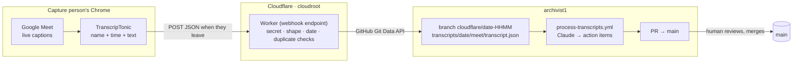
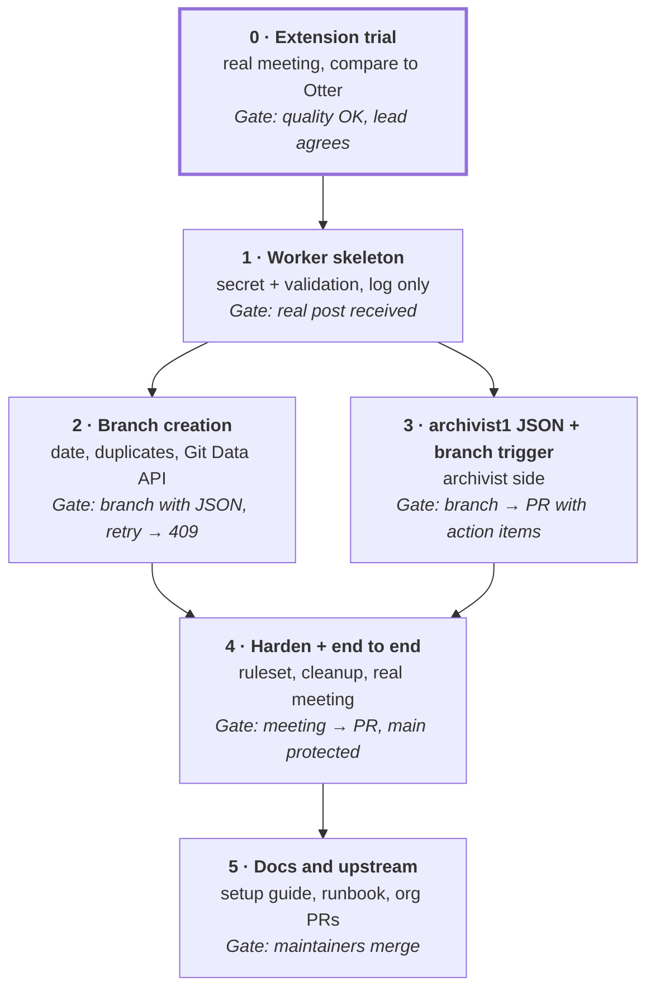

# Meeting Transcript Capture — Project Plan

## Overview

The TranscripTonic Chrome extension saves Google Meet's live captions with speaker names. When the meeting ends, it posts them as JSON to a Cloudflare Worker in cloudroot. The Worker creates a `cloudflare/<date>-<HHMM>` branch in archivist1 holding `transcripts/<date>/meet/transcript.json`. archivist1's workflow processes that branch and opens a PR for a person to review and merge.

**Constraints:** $0 running cost. No audio is ever recorded or stored. Nothing reaches archivist1's `main` without human review.

**In scope (this task):** extension setup, the Worker (validate, then create a branch with the JSON), deployment, and docs.

**Related, owned on the archivist side:** JSON support and the `cloudflare/**` branch trigger in archivist1. Summarized in *archivist1 changes* for context.

**Out of scope:** action-item extraction logic, the PR review itself, ingestion into cloudroot's Pinecone knowledge base, Zoom and Teams.

**How we work:** build in the **cloudroot fork** against the **archivist1 fork**. Each phase ends in one reviewable commit. Move upstream to the organization's repos after phase 4 passes, and only once the org lead agrees to the switch from the Vexa design.

## How it works

There is one manual job per meeting: the capture person attends in desktop Chrome and stays until the end. Reviewing the PR is the only other human step, and it already exists today.



1. **Before the meeting (once):** the capture person has TranscripTonic installed in auto mode. Its webhook URL points at the Worker, it sends the advanced (JSON) body, and it auto-posts and auto-downloads after each meeting.
2. **During the meeting:** the extension turns on Meet's captions, visible only to the capture person, and saves each entry as `personName`, `timestamp` and `transcriptText`, plus chat. Nothing leaves the browser yet.
3. **When the capture person leaves the call:** the extension sends one HTTP POST with the JSON to the Worker. The Worker is the webhook endpoint; the extension is the sender.
4. **The Worker validates:** secret, payload shape and size, then the date from `meetingStartTimestamp` in Pacific time. It checks that the date isn't already used on `main` or on another `cloudflare/<date>*` branch.
5. **The Worker creates the branch:** a commit holding `transcripts/<date>/meet/transcript.json`, with `main` as its parent, then the branch `cloudflare/<date>-<HHMM>` pointing at it. It replies 200, and the extension marks the meeting as sent.
6. **archivist1 runs:** the new branch starts `process-transcripts.yml`. It reads the JSON, extracts action items with Claude, commits the results back to that branch, and opens a PR into `main`.
7. **A person reviews and merges.** Merged branches are deleted automatically.

If any step fails, the extension keeps the transcript and shows a retry notification, and auto-download leaves a local copy. Retrying the same meeting produces the same branch name, so it can't create a duplicate.

## Tech stack and cost

| Piece | Role | Cost | Notes |
| --- | --- | --- | --- |
| TranscripTonic (Chrome extension) | Saves Meet captions with speaker names, then posts the JSON | $0 | MIT open source, 10,000+ users, updated Sept 2026. Captions are free on every Google account. |
| Google Meet live captions | The actual speech-to-text | $0 | Google's own captions. No audio is recorded. |
| Cloudflare Worker (cloudroot) | Webhook endpoint: validates, then creates the branch in archivist1 | $0 | Free plan: 100,000 requests a day. Deployed the same way as cloudroot's existing `worker/`. |
| GitHub REST API (Git Data) | Creates the commit and branch | $0 | Fine-grained token scoped to archivist1 only |
| archivist1 `process-transcripts.yml` | Action items, then PR | Unchanged cost | Runs on Claude via the org's existing subscription token |

No VM, no Whisper, no storage bucket, no paid API.

## Definitions

| Term | Meaning in this plan |
| --- | --- |
| TranscripTonic | Free, open-source Chrome extension that saves Google Meet captions with each speaker's name and a timestamp |
| Capture person | The attendee whose Chrome runs the extension with the webhook set up. They must stay until the meeting ends. |
| Auto mode | Extension setting that starts capturing automatically when the capture person joins a Meet |
| Webhook | A URL that another app calls with an HTTP POST when something happens. Here the extension calls it when the meeting ends. |
| Webhook endpoint | The program at that URL. Here, the Cloudflare Worker. |
| Cloudflare Worker | A small program on Cloudflare's servers that answers HTTP requests. It can serve a website, an API, or, as here, receive webhooks. |
| Webhook secret | A long random string in the Worker URL. Requests without it are rejected. |
| Advanced body | The extension's JSON format: meeting title, start/end times, and a `transcript` list of `{personName, timestamp, transcriptText}` entries |
| `meetingStartTimestamp` | When the meeting started, in UTC. The Worker converts it to Pacific time for the date and the branch name. |
| `cloudflare/<date>-<HHMM>` branch | One branch per meeting, e.g. `cloudflare/2026-10-01-1800`. It starts archivist1's workflow and becomes the PR. |
| Git Data API | GitHub's lower-level API for building a commit (tree, commit, ref) without running git |
| Fine-grained token | GitHub token limited to one repo and one permission. Here: archivist1, Contents read/write. |
| Ruleset | GitHub branch protection. Used here so nothing, including the Worker's token, can push directly to `main`. |
| Gate | The check that must pass before the next phase starts |

## Build phases

Six phases. Phase 0 is the go/no-go: if caption quality or auto-start disappoints on a real meeting, fall back to the Vexa design in the appendix. Phase 3 is the archivist-side work and can run alongside phase 2.



| Phase | What gets built | Done when (gate) |
| --- | --- | --- |
| 0 · Extension trial | Install TranscripTonic, set auto mode and auto-download, no webhook yet. Use it in a real team meeting. Compare its text file with a past Otter transcript in archivist1. Share the result with the org lead. No code. | Speaker names and wording are good enough. Auto mode started capture without anyone touching the CC button. The org lead agrees to switch from the Vexa design. |
| 1 · Worker skeleton | `transcript-intake/` in the cloudroot fork: wrangler config, `POST /ingest/<secret>` route, secret check, payload validation (Meet only, non-empty, size limit). It logs the payload shape and returns 200 without writing to GitHub. A deploy workflow copied from `deploy-worker.yml`. | A real meeting's post reaches the deployed Worker, and a bad secret gets 401. A redacted copy of the payload is saved as a test fixture. |
| 2 · Branch creation | Date and `<HHMM>` from `meetingStartTimestamp` in Pacific time. Duplicate checks on `main` and `cloudflare/<date>*` branches. Git Data API calls: tree → commit → ref. Errors mapped to clear responses. Unit tests with a mocked GitHub. | Replaying the fixture creates `cloudflare/<date>-<HHMM>` in the archivist1 fork, containing only `transcripts/<date>/meet/transcript.json` on top of `main`. Replaying again returns 409. `main` is unchanged. |
| 3 · archivist1 JSON + branch trigger | Archivist side (see *archivist1 changes*): trigger on `cloudflare/**`, JSON reader with a compact view for Claude, evidence check on `transcriptText`, results committed back to the branch, PR into `main`. | The branch from phase 2 produces a PR with action items and the archived JSON. |
| 4 · Harden + end to end | Ruleset on archivist1's `main` blocking direct pushes. Auto-delete merged branches. Token-expiry reminder. Turn the webhook on in the capture person's extension. | A real meeting goes all the way to a PR with no manual steps. A direct push to `main` with the Worker's token is refused. |
| 5 · Docs and upstream | cloudroot README section: capture-person setup guide, secrets list, troubleshooting runbook. PRs to the org's cloudroot and archivist1. Switch `ARCHIVIST_REPO` to the org repo. | Maintainers review and merge. |

## Worker spec

The Worker has one route: `POST /ingest/<WEBHOOK_SECRET>`. Every other path or method returns 404.

**Checks, in order**

1. The secret in the path matches `WEBHOOK_SECRET` (constant-time compare). Otherwise 401.
2. The body is JSON with `webhookBodyType: "advanced"`, `meetingSoftware` is Google Meet, `transcript` is a non-empty list, and the size is under a limit (e.g. 5 MB). Otherwise 400.
3. The date and time come from `meetingStartTimestamp`, converted to `America/Los_Angeles`, giving `date = YYYY-MM-DD` and `HHMM`.
4. Duplicate check: `transcripts/<date>/` and `archived/<date>/` must not exist on `main`, and no branch may match `cloudflare/<date>*`. Otherwise 409.

**GitHub calls** (base `https://api.github.com/repos/<ARCHIVIST_REPO>`, header `Authorization: Bearer <ARCHIVIST_TOKEN>`)

| # | Call | Purpose |
| --- | --- | --- |
| 1 | `GET /git/ref/heads/main` | Current `main` commit, and its tree |
| 2 | `GET /contents/transcripts/<date>`, `GET /contents/archived/<date>`, `GET /git/matching-refs/heads/cloudflare/<date>` | Duplicate check: expect 404, 404, and an empty list |
| 3 | `POST /git/trees` with `base_tree` = main's tree, plus one entry `transcripts/<date>/meet/transcript.json` (mode `100644`, content = the pretty-printed JSON) | The file tree for the new commit |
| 4 | `POST /git/commits` with `message`, `tree`, `parents: [main sha]` | The commit |
| 5 | `POST /git/refs` with `ref: refs/heads/cloudflare/<date>-<HHMM>` | Creates the branch, which is the single push event. 422 here means it already exists, returned as 409. |

The file is stored exactly as received, pretty-printed. The Worker adds no reformatting.

**Responses**

| Worker returns | When | Extension shows |
| --- | --- | --- |
| 200 | Branch created | Sent |
| 400 / 401 | Bad payload or secret | Failed (fix the config) |
| 409 | Date already used, or same meeting sent twice | Failed (safe to ignore if already received) |
| 500 | GitHub token rejected (expired or missing permission) | Failed. Renew the token, then retry. |
| 502 | GitHub or network error | Failed. Retry later. |

Logs record the date, branch name, entry count and status, never transcript text.

## archivist1 changes

These are owned on the archivist side and listed here so the two halves line up.

| Where | Change |
| --- | --- |
| `process-transcripts.yml` trigger | `push` on `branches: ["cloudflare/**"]` with `paths: ["transcripts/**/transcript.json"]` |
| Workflow output | Commit the action items and the archive move back onto the same `cloudflare/…` branch, then open the PR into `main`. Pushes made with the built-in `GITHUB_TOKEN` don't re-trigger workflows, so there's no loop. |
| `processor.py` | Accept `transcript.json` as well as `.txt`, and archive the file under its own name |
| Transcript reader | Parse the JSON and give Claude a compact view, one line per entry like `[12:04] Priya: …`, not raw JSON. That keeps token use the same as today. |
| `evidence.py` | Check quotes against the joined `transcriptText` values, not the raw file, so JSON escaping can't cause false failures |
| `tests/` | JSON fixture from phase 1, alongside the existing Otter `.txt` cases |
| Repo settings | Auto-delete head branches. A ruleset on `main` that requires a PR. |

Keep `.txt` support for old Otter files and manual uploads. When the merged PR deletes `transcripts/<date>/…`, the existing `main` trigger may fire once and find nothing pending, which is harmless. It can be dropped if all transcripts now arrive through the Worker.

## Secrets and config

| Name | Lives in | Used for |
| --- | --- | --- |
| `WEBHOOK_SECRET` | Worker secret, and the capture person's extension (inside the URL) | Rejects posts that don't come from our extension |
| `ARCHIVIST_TOKEN` | Worker secret only | Fine-grained token: archivist1 only, Contents read/write. Expires at most yearly, so set a renewal reminder. Use a non-admin account, so the `main` ruleset applies to it. |
| `ARCHIVIST_REPO` | Worker variable | `ravi-p-k-1/archivist1` now, the org repo after phase 5 |
| `CLOUDFLARE_API_TOKEN`, `CLOUDFLARE_ACCOUNT_ID` | cloudroot GitHub secrets (already exist) | Deploying the Worker |

Secrets are set with `wrangler secret put` from the deploy workflow, the same way the existing `worker/` gets its LLM keys. If the webhook URL ever leaks, change `WEBHOOK_SECRET` and update the extension. At worst a stranger could open an unwanted branch and PR, which someone closes.

## Repo structure

In the cloudroot fork, one new folder and one workflow. Nothing else is touched.

```
cloudroot/
├── .github/workflows/
│   └── deploy-transcript-intake.yml   # deploy Worker + push secrets (copy of deploy-worker.yml)
└── transcript-intake/
    ├── README.md                      # capture-person setup guide + runbook
    ├── wrangler.toml
    ├── package.json
    ├── src/
    │   ├── index.js                   # route, secret check, responses
    │   ├── validate.js                # payload shape, size, Meet only
    │   ├── naming.js                  # date + HHMM in America/Los_Angeles
    │   └── github.js                  # duplicate checks, tree → commit → ref
    └── test/
        ├── fixtures/sample-meeting.json  # redacted, from phase 1
        └── worker.test.js             # mocked GitHub
```

## Risks and open questions

**Risks**

- **One person carries every meeting.** If the capture person misses a meeting, joins from a phone, or leaves early, that meeting is lost or cut short. Mitigation: a backup capture person with the same setup. The Worker's duplicate check makes it safe for both to post.
- **Caption quality is Google's.** Usually good in English, but names and jargon may be wrong, and it can't be tuned. Phase 0 judges whether it's good enough.
- **The extension changes or breaks.** It reads Meet's on-page captions, so a Meet redesign can break it until the developer updates it. Mitigation: pin a known-good version, with the Vexa design as fallback.
- **Consent.** Captions are visible only to the capture person, so others won't see that a transcript is being made. Announce it, or follow the org's existing Otter policy.
- **The token expires.** Fine-grained tokens last at most a year. Posts then fail with 500 and can be retried after renewal. Consider a GitHub App when moving to the org.
- **Extension telemetry.** TranscripTonic sends its developer anonymous version numbers and error codes, but no transcript content.

**Decided**

- Store the extension's JSON as is (`transcript.json`), with no reformatting in the Worker.
- Folder date comes from `meetingStartTimestamp` in Pacific time, not from when the post arrives.
- One branch per meeting, `cloudflare/<date>-<HHMM>`. Nothing is written to `main` directly.
- One transcript per date.

**Open questions**

- [ ] Does the org lead approve switching from the Vexa design? (Phase 0)
- [ ] Who is the capture person, and who is the backup?
- [ ] Is Pacific time right for every meeting the org runs?

## Appendix: Vexa fallback design

If phase 0 fails, or the org wants capture with no attendee involved, this is the design worked out on Oct 1.

- **Capture:** self-hosted Vexa Lite on an Oracle Always Free ARM VM (2 OCPU / 12 GB). The bot joins as an anonymous guest and someone admits it.
- **Transcription:** live, on the VM, with Vexa's bundled faster-whisper (`LOCAL_STT=1`, `small.en`). Names come from Meet's per-participant audio. Recording is off, so no audio is stored. `speaker_events` can't be used, because nothing writes it in Vexa v0.12 (issue #861).
- **Orchestration:** a cloudroot workflow, run by hand with the Meet URL:
  1. Start the stopped VM with the Oracle CLI.
  2. Send the bot over an SSH tunnel and poll until the meeting ends.
  3. Fetch the named segments and deliver them to archivist1. This would use the same `cloudflare/` branch flow as above.
  4. Delete the meeting in Vexa, and always stop the VM.
- **Main risks:** 2 ARM cores keeping up with live Whisper, Oracle having no free ARM capacity at start time, Vexa API churn, and a 6-hour Actions job limit.
- **Free fallbacks if CPU is too slow:** `base.en`, Cloudflare Workers AI Whisper (about 214 free minutes a day), and Groq's free tier.

## Sources

- [TranscripTonic on the Chrome Web Store](https://chromewebstore.google.com/detail/transcriptonic/ciepnfnceimjehngolkijpnbappkkiag): free, MIT, auto mode, webhooks
- [TranscripTonic source](https://github.com/vivek-nexus/transcriptonic): `types/index.js` (webhook body fields), `extension/background-script/exporters.js` (the POST with only a Content-Type header, retry on failure)
- [archivist1 fork](https://github.com/ravi-p-k-1/archivist1): `process-transcripts.yml`, `archivist/evidence.py`, `archivist/processor.py`
- [cloudroot fork](https://github.com/ravi-p-k-1/cloudroot): `worker/` and `deploy-worker.yml`, the pattern for the new Worker
- [Google Meet recording by plan](https://videotobe.com/google-meet-recording-plans-comparison): why built-in Drive recording isn't free
- [Vexa repo](https://github.com/Vexa-ai/vexa) and [Oracle Always Free resources](https://docs.oracle.com/en-us/iaas/Content/FreeTier/freetier_topic-Always_Free_Resources.htm): appendix design
