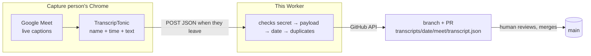

# Transcript Intake Worker

A Cloudflare Worker that turns a Google Meet transcript into a reviewed
pull request, with no manual copy-pasting and no paid transcription API.

**The pipeline:** the free [TranscripTonic](https://chromewebstore.google.com/detail/transcriptonic/ciepnfnceimjehngolkijpnbappkkiag)
Chrome extension captures Google Meet's built-in captions (with speaker
names) and posts the transcript as JSON when the meeting ends. This Worker
receives that webhook, validates it, and opens a pull request into a
GitHub repo containing the transcript file. From there, a separate
workflow (not part of this folder — see below) can extract action items
and comments on the PR for a human to review and merge.

No audio is ever recorded. No VM, no Whisper, no paid transcription API —
captions are Google's own, free on any account.

If you're looking for the companion GitHub Actions workflow that turns the
PR's transcript into action items, that lives in a separate target repo
(this project's own instance points at [archivist1](https://github.com/ravi-p-k-1/archivist1));
see [PLAN.md](PLAN.md) for the full two-repo design.

## How it works



1. **One-time setup:** the person capturing meetings installs TranscripTonic, sets it to auto mode, and points its webhook at this Worker's URL (with a secret in the path) using the "advanced" (JSON) body format.
2. **During a meeting:** the extension turns on Meet's captions (visible only to the capturing person) and records each line as `{personName, timestamp, transcriptText}`. Nothing leaves the browser yet.
3. **When the meeting ends:** the extension POSTs the full transcript as JSON to this Worker.
4. **This Worker:**
   - Rejects anything without the correct secret (401) or a malformed/oversized payload (400).
   - Derives a date and time from the meeting's start timestamp (Pacific time by default).
   - Checks that date hasn't already been used, to avoid duplicates (409 if so).
   - Creates a new branch holding `transcripts/<date>/meet/transcript.json`, and opens a pull request into `main` — using GitHub's Git Data API directly, no local git needed.
5. **A human reviews and merges the PR.** Everything after that (extracting action items, archiving, etc.) is downstream of this Worker and lives in the target repo, not here.

If the Worker fails for any reason, the extension keeps the transcript locally and flags it for retry — no data is lost. See the [Responses](#responses) section below for exactly what each failure mode means and how to recover from it.

## Setup

### 1. Fork and deploy

This folder is meant to be deployed from your own fork of this repo:

```bash
cd transcript-intake
npm install
```

You'll need four values before deploying — three as GitHub Actions secrets, one as a plain repository variable:

| Name | What it is | How to get it |
| --- | --- | --- |
| `WEBHOOK_SECRET` | A long random string that gates the endpoint | Generate one yourself, e.g. `openssl rand -hex 32` |
| `ARCHIVIST_TOKEN` | A GitHub token scoped to your target repo | A [fine-grained personal access token](https://github.com/settings/personal-access-tokens/new), repository access limited to your target repo only, with **Contents** and **Pull requests** permissions set to **Read and write** |
| `CLOUDFLARE_API_TOKEN`, `CLOUDFLARE_ACCOUNT_ID` | Credentials for deploying the Worker itself | Cloudflare dashboard → My Profile → API Tokens (use the "Edit Cloudflare Workers" template) and Workers & Pages overview page |
| `ARCHIVIST_REPO` *(variable, not a secret)* | `owner/repo` of your target GitHub repo | Set directly in `wrangler.toml`'s `[vars]` block |

Add the three secrets to your fork with `gh secret set <NAME> --repo <your-account>/<your-fork>`, or by hand under **Settings → Secrets and variables → Actions**.

Then push to `main` with changes under `transcript-intake/` (or trigger the **Deploy Transcript Intake Worker** workflow manually from the Actions tab). It installs dependencies, runs the test suite, pushes your secrets into Cloudflare, and deploys.

### 2. Point TranscripTonic at it

In the extension's settings (its popup → "Last 10 meetings" → the webhook section):

- **Webhook URL:** `https://<your-worker>.<your-subdomain>.workers.dev/ingest/<your-webhook-secret>`
- **Body type:** select **Advanced webhook body** (not the default "Simple")
- Leave "Automatically post transcript to webhook URL" checked

Saving the URL triggers a native Chrome permission prompt asking to allow the extension to reach that host — **make sure to accept it**. Without that permission, Chrome blocks the automatic post at meeting-end with no clear error.

### 3. Local development

```bash
cp .dev.vars.example .dev.vars   # fill in a test WEBHOOK_SECRET and ARCHIVIST_TOKEN; never committed
npm run dev
```

Send it a sample payload:

```bash
curl -X POST "http://localhost:8787/ingest/$(grep WEBHOOK_SECRET .dev.vars | cut -d= -f2)" \
  -H "Content-Type: application/json" \
  --data @test/fixtures/sample-meeting.json
```

This talks to your real target repo (via `ARCHIVIST_TOKEN`), so a local run genuinely creates a branch and PR there. Replay the same payload twice to see the 409 duplicate-detection path.

Run the unit tests (pure Node — no Cloudflare runtime needed, `src/github.js`'s tests mock the GitHub API rather than calling it):

```bash
npm test
```

## API

```
POST /ingest/<WEBHOOK_SECRET>
```

Every other path or method returns 404. The webhook secret is checked with a constant-time comparison.

**Payload requirements** (`src/validate.js`): JSON body with `webhookBodyType: "advanced"`, `meetingSoftware: "Google Meet"`, a non-empty `transcript` array where every entry has `personName`, `timestamp`, and `transcriptText`, and a parseable `meetingStartTimestamp`. Capped at 5 MB.

### Responses

| Status | Meaning | What to do |
| --- | --- | --- |
| 200 | Branch and PR both created | Nothing — it worked |
| 400 | Bad or oversized payload | Check the extension's webhook body type is "Advanced" |
| 401 | Wrong or missing secret | Check the URL matches your configured `WEBHOOK_SECRET` exactly |
| 409 | That date already has a transcript or an open branch | Safe to ignore if you've already received it; otherwise check for a stale branch |
| 500 | `ARCHIVIST_TOKEN` was rejected before anything was created | Check the token hasn't expired or lost its permissions, then retry |
| 502 | A GitHub or network error, **or** the branch was created but opening the PR failed | For the partial-failure case, open the PR by hand from the branch that already exists — retrying the webhook will just hit 409 |

Logs record the date, branch name, and entry counts — never the transcript content itself.

## Project layout

```
.github/workflows/deploy-transcript-intake.yml   # CI: test, deploy, push secrets to Cloudflare
transcript-intake/
├── src/
│   ├── index.js       # routing, secret check, orchestration
│   ├── validate.js    # payload shape/size checks
│   ├── naming.js       # date + HH:MM in America/Los_Angeles from the meeting start time
│   └── github.js       # branch + PR creation via GitHub's Git Data API
├── test/               # unit tests + a redacted sample payload fixture
├── wrangler.toml        # Worker config (target repo set here as a variable)
├── .dev.vars.example    # local dev secrets template
└── PLAN.md              # full design doc, including the downstream processing side
```

## Status

The Worker itself (this folder) is complete and has processed real meetings
end-to-end. What's still in progress is entirely on the downstream side —
turning the opened PR into reviewed, extracted action items. See
[PLAN.md](PLAN.md) for the phased build plan and current status.

## Contributing

Pull requests welcome. If you're using an AI coding agent (Claude Code,
etc.) to work in this folder, see [AGENTS.md](AGENTS.md) for conventions
specific to this project.
